<div align="center">



<br/>

<a href="https://elladeniyadev.vercel.app/"></a>&nbsp;<a href="https://www.linkedin.com/in/gividuelladeniya/"></a>&nbsp;<a href="mailto:gividuelladeniya@gmail.com"></a>&nbsp;

</div>

<br/>

```ts
const gividu = {
  location : "Colombo, Sri Lanka 🇱🇰",
  studying : "BSc (Hons) IT @ SLIIT",
  stack    : ["React", "Next.js", "Vue", "Spring Boot", "Node.js"],
  data     : ["MySQL", "MongoDB"],
  mobile   : ["Kotlin", "Android SDK"],
  learning : ["System Design", "Cloud", "Architecture"],
};
```

Mostly building web apps, occasionally native Android, and lately anything that
lets me poke at system design. Pin-worthy stuff is pinned below 👇

<br/>

## Tech

<div align="center">

[](https://skillicons.dev)

[](https://skillicons.dev)

[](https://skillicons.dev)

[](https://skillicons.dev)

</div>

<br/>

## Stats

<!--
  Note on services: github-readme-stats has been paused by its owner since Jan 2026,
  so anything pointing at github-readme-stats.vercel.app renders a broken image.
  The cards below use github-profile-summary-cards + streak-stats, both live and
  token-free. Verified working before committing.
-->

<div align="center">


<br/><br/>


<br/>


<br/><br/>


</div>

<br/>

<div align="center">

<picture>
  <source media="(prefers-color-scheme: dark)"  srcset="https://raw.githubusercontent.com/elladeniya-dev/elladeniya-dev/output/github-contribution-grid-snake-dark.svg" />
  <source media="(prefers-color-scheme: light)" srcset="https://raw.githubusercontent.com/elladeniya-dev/elladeniya-dev/output/github-contribution-grid-snake.svg" />
  
</picture>

</div>

<br/>

<div align="center">
<sub>Built in Colombo, Sri Lanka </sub>
</div>
